# Flows

afk-fleet turns a repo's ready GitHub issues into merged PRs with nobody watching, for days, across
one or several machines.

The nouns are in [`CONTEXT.md`](../CONTEXT.md), the reasons in [`docs/adr/`](adr/). This file is the
verbs: what happens, in what order, and what it leaves behind.

**Reading the anchors.** The fleet is a doc-driven skill (ADR-0004): the **launcher** is an LLM
session executing the prose of `skills/afk-fleet/SKILL.md`, the **tick** it runs each cycle is code
(ADR-0028), the **worker** executes
`skills/afk-fleet/references/worker-prompt.md`, and every deterministic step is a subcommand of
`skills/afk-fleet/scripts/afk.py` deciding through a pure function in
`skills/afk-fleet/scripts/afk_decide.py`. Each thing a tick *does* to a claim — start a worker, land
a PR, fail, escalate, park, close — is one such subcommand performing its whole ordered sequence
(ADR-0017), so most steps below anchor into code. An anchor into a `.py` file names a function, and
an anchor into a `.md` file names a word in the passage that step is executed from. Check them all with
the `mainline` skill's `verify-anchors.sh docs/flows.md`.

## How does a ready issue become a merged PR?

1. A **tick** starts with nothing in memory and **rebuilds** its **working set** from GitHub: open
   issues, open PRs, claim and heartbeat refs — three reads made at once, each made once a tick.
   `skills/afk-fleet/scripts/afk.py:cmd_rebuild`
2. The **frontier** is selected: an issue is dispatchable only if it is open, carries the ready
   label, is not an epic, is unclaimed, has no open linked PR and has zero open blockers.
   `skills/afk-fleet/scripts/afk_decide.py:select_frontier`
3. For each slot still free under `concurrency` — the bound on the claims a fleet holds — once the
   **stale claims** have taken theirs, the tick **dispatches** an issue, and the dispatch begins
   by **claiming** it: refreshing the fleet's **heartbeat** if it is due, and only then creating the
   claim ref, which the server accepts for exactly one **fleet instance**; a loser starts nothing.
   `skills/afk-fleet/scripts/afk.py:cmd_dispatch`
4. The dispatch fetches the base's tip from the remote and has orca create the worktree and branch
   at that sha, then asserts the worktree contains it.
   `skills/afk-fleet/scripts/afk.py:cut`
5. It starts a **worker** there with the run's **worker launch command**, waits until the agent is
   ready, and delivers the worker prompt, filled with the branch and path orca returned, as a brief
   file plus one submitted line pointing at it. A tick filling several slots begins every start
   first and then waits for all the agents together.
   `skills/afk-fleet/scripts/afk.py:put`
6. It upserts the issue's **status board** to "claimed"; the tick ends without waiting for the
   worker, its **heartbeat** fresh since before step 3's claim.
   `skills/afk-fleet/scripts/afk.py:_upsert_board`
7. The worker implements the issue's acceptance criteria, committing and pushing its own branch
   after every completed step so a hard stop loses at most the step in flight.
   `skills/afk-fleet/references/worker-prompt.md:Publish`
8. The worker **syncs** (merges the base into its branch, never rebases), pushes, and runs the
   **local gate** until it is green on the combined tree — through `afk gate`, which puts a green
   run on record on the remote, under the tree it tested.
   `skills/afk-fleet/scripts/afk.py:cmd_gate`
9. The worker opens a PR whose body says `Closes #n`, **wakes** the launcher with one line that
   carries nothing, and stops; it does not merge yet.
   `skills/afk-fleet/scripts/afk_decide.py:wake_command`
10. A later tick's rebuild matches that PR to the claim and classifies it: awaiting its **landing
    turn** once its checks are green (or, with `gate.ci: local`, as soon as the PR is open).
    `skills/afk-fleet/scripts/afk_decide.py:claim_status`
11. One PR at a time, in merge order, the tick grants the **landing turn**: it records the turn as
    a marker comment on the PR and tells the worker — one submitted line pointing at a landing
    brief — to land it. The tick merges nothing.
    `skills/afk-fleet/scripts/afk.py:cmd_turn`
12. The worker runs `afk land` in its own worktree, which refuses without the turn, then syncs the
    branch with the merge target again and pushes what that produced.
    `skills/afk-fleet/scripts/afk.py:_sync`
13. The landing re-confirms the gate against the exact head that will land: the local gate run
    there, or the PR's checks on that head, which the landing waits for itself when its sync
    pushed a new one.
    `skills/afk-fleet/scripts/afk_decide.py:checks_owed`
14. It merges the PR, pinned to the gated head, which closes the issue, and upserts the status
    board to "merged"; the worker wakes the launcher and stops.
    `skills/afk-fleet/scripts/afk.py:cmd_land`
15. The next tick finds a claim of its own whose issue is closed and releases it: orca removes
    the worktree, then the claim is deleted, freeing the slot — and the landing turn goes to the
    next PR.
    `skills/afk-fleet/scripts/afk.py:cmd_release`

**Where it forks.**
- The worker opens no PR and leaves an `afk:verdict` marker instead (already-satisfied, blocked,
  giving-up, needs-decision), or goes quiet: `skills/afk-fleet/scripts/afk_decide.py:classify_stopped`.
- While the worker is still at it, the tick's question costs no GitHub read: the worker state its
  runtime reported to orca settles it, `skills/afk-fleet/scripts/afk_decide.py:read_worker_state`
  (ADR-0021).
- The worker went idle past grace with no PR and no verdict at all: it is nudged once, in its own
  terminal, before that silence counts as a failure, `skills/afk-fleet/scripts/afk.py:cmd_nudge`
  (ADR-0018).
- The worker declared the issue already satisfied and its branch is empty: the tick verifies the
  empty diff and closes it, `skills/afk-fleet/scripts/afk.py:cmd_close`.
- The PR's checks are red before any turn is granted: the retry mainline below.
- Another PR of this fleet holds the landing turn: this one waits, awaiting its turn — not synced,
  not told anything, its slot held — so each PR of a conflicting group is resolved once, against a
  target that already holds the ones before it, `skills/afk-fleet/scripts/afk_decide.py:turn_order`
  (ADR-0027).
- Two or more PRs may land together (`gate.ci: local`, no adversarial verify owed): the turn goes to all of them as one
  **merge batch**, `skills/afk-fleet/scripts/afk_decide.py:batch_candidates` — a batch worker in a
  worktree of the batch's own stacks them on the target with one merge commit per PR, gates the stack
  once and pushes it to the target as a fast-forward, `skills/afk-fleet/scripts/afk.py:_land_batch`;
  each PR's own head is then on the target, so GitHub shows it merged. A PR that conflicts with the stack is
  left out and takes a single turn; a batch whose worker stays silent is abandoned
  (ADR-0029, ADR-0034).
- The landing's sync conflicts: the merge is left in progress in the worker's own worktree, and the
  worker resolves it, commits and lands again — claim, PR, branch, worktree and turn kept, no
  attempt spent, `skills/afk-fleet/scripts/afk_decide.py:land_outcome`.
- The landing's gate is red: the worker fixes the code, commits and lands again; the excerpt is
  also a PR comment, `skills/afk-fleet/scripts/afk_decide.py:gate_comment`.
- A recorded gate run of the command configured now stands for the tree that would land: step 13
  does not run the local gate again, `skills/afk-fleet/scripts/afk_decide.py:gate_record_void`
  (ADR-0030). Any sync that moved the head, any later commit, a record past its day, or no record,
  and it runs as written.
- The landing's sync moved the head and the next move is the tick's — the checks on the new head
  were still running when the landing's wait ran out, or an adversarial verify is owed on it: the
  landing stops, the worker wakes the launcher,
  the turn stays with the PR, and the tick's next `afk turn` tells the worker to land again once
  that is settled, `skills/afk-fleet/scripts/afk_decide.py:turn_gate`.
- The PR has no checks at all, or an adversarial verify is required: the turn is not granted until
  the tick decides (`--allow-no-checks`, `--verified`), `skills/afk-fleet/SKILL.md:needs_verify`.
- The worker's terminal is gone when its turn comes: a new worker is started by continuation in
  the same worktree — or one recreated at the PR's head — briefed only to land the PR,
  `skills/afk-fleet/scripts/afk_decide.py:render_landing`.
- The worker goes silent on its turn: it is nudged once and then failed like any other silence,
  which closes its PR and frees the turn, `skills/afk-fleet/scripts/afk_decide.py:classify_stopped`.
- A peer wins the claim race, or the claim push fails outright (an error, never a lost race):
  ADR-0015.
- `--plan` stops after step 2 and returns the dispatch plan: ADR-0002.

## How does a fleet launch and then run for days?

1. A human invokes `/afk-fleet`, and that invocation is the whole go-ahead to push and auto-merge —
   nothing is previewed or confirmed (ADR-0023); the **launcher** loads the target repo's config
   file, validated against the one schema with defaults filled, and refuses to run on an unknown key.
   `skills/afk-fleet/scripts/afk.py:cmd_config`
2. The launcher mints this run's instance id and probes the remote for which claim namespace it may
   push under, and, with a local gate, whether the merge target demands status checks.
   `skills/afk-fleet/scripts/afk.py:cmd_probe`
3. The launcher settles the **worker launch command**: a stock launcher is never asked, a launcher on
   a custom provider uses the command passed with the invocation, or has the human pick one, and the
   answer is checked to resolve.
   `skills/afk-fleet/scripts/afk.py:cmd_worker_command`
4. Each cycle, the launcher itself makes one call, handing it only the repo, the config and the
   cycle state; the call digests what a rebuild would observe and decides skip or tick — the raw
   state never enters a context.
   `skills/afk-fleet/scripts/afk.py:cmd_cycle`
5. When the digest moved, that same call runs the reconciliation pass (the mainline above) in code:
   the decision core says which transition comes next, one step at a time, and the call carries
   each one out and reports how it ended. What it could not decide comes back as judgments, each
   with the transition for either answer; the launcher runs the one it chooses and opens the next
   cycle at once.
   `skills/afk-fleet/scripts/afk_decide.py:tick_plan`
6. The call folds what the pass did into the cycle state — which also carries the two
   launcher-held facts (instance id, worker launch command) — with the digest of the fleet as the
   pass left it, so its own writes do not cause the next tick, and counts whether the cycle was empty.
   `skills/afk-fleet/scripts/afk_decide.py:cycle_ticked`
7. The launcher sleeps the interval that call returned — busy, or idle after enough consecutive
   empty cycles, never longer than half the lease while the fleet holds a claim — then repeats from
   step 4. Its context may be compacted at any point: the repo, the config and the cycle state are
   all the next cycle needs (ADR-0028).
   `skills/afk-fleet/scripts/afk_decide.py:pace`
8. On the human's word, one last cycle — the drain — releases the claims that have no PR and keeps
   the ones that do, and the launcher runs no more cycles.
    `skills/afk-fleet/scripts/afk.py:_drain`

**Where it forks.**
- The digest is unchanged: no pass is run, the same call refreshes the heartbeat if the fleet
  holds claims and returns the sleep, and a full tick is forced every sixth
  cycle: `skills/afk-fleet/scripts/afk_decide.py:cycle_wake`, ADR-0007.
- A worker's **wake** arrives during the sleep of step 7: the launcher goes to step 4 at once, and
  acts on nothing the line says, `skills/afk-fleet/SKILL.md:wake`, ADR-0020.
- A wake arrives while the call of step 4 is still running: the next cycle is opened at once with
  `--wake`, and ticks whatever its digest says — the pass may have digested, unseen, the change the
  wake was about, `skills/afk-fleet/scripts/afk_decide.py:cycle_wake`, ADR-0007.
- The org forbids `refs/afk/*`, so claims fall back to ordinary branches:
  `skills/afk-fleet/scripts/afk.py:_usable_namespace`.
- A local gate meets a target branch that requires checks, and bootstrap stops:
  `skills/afk-fleet/scripts/afk_decide.py:protection_verdict`, ADR-0012.
- The launcher runs under qoderclicn, so the command is stock and nobody is asked:
  `skills/afk-fleet/scripts/afk_decide.py:detect_runtime`, ADR-0014.

## What happens to an issue when the fleet working on it dies?

1. Before it takes a claim and while it holds any, a fleet instance refreshes its one **heartbeat**
   ref whenever it is older than a third of the lease.
   `skills/afk-fleet/scripts/afk_decide.py:heartbeat_due`
2. The fleet hard-stops and runs no code; a peer's next rebuild finds a claim whose owner's heartbeat
   is older than the claim lease, and classifies it a **stale claim**.
   `skills/afk-fleet/scripts/afk_decide.py:classify_claims`
3. The peer takes the claim: it refreshes its own heartbeat if due, then re-stamps the ref with its
   own instance, a push the server rejects unless the ref still points at the sha the peer read.
   `skills/afk-fleet/scripts/afk.py:cmd_reclaim`
4. The peer **dispatches** the issue it now holds; the dispatch asks what survived the death: a
   worktree for the issue still on this machine, and the issue's branch on the remote ahead of base.
   `skills/afk-fleet/scripts/afk.py:_recovery`
5. **Continuation** picks the tier: reuse the worktree, else recreate one at the pushed branch tip,
   else start fresh from base.
   `skills/afk-fleet/scripts/afk_decide.py:select_recovery`
6. The dispatch starts a new worker there with the continue-mode prompt, which has it inspect the
   existing progress before anything else and treat it as partial work toward the same criteria.
   `skills/afk-fleet/scripts/afk_decide.py:render_worker_prompt`
7. The issue rejoins the first mainline at its step 7, its claim kept and its retry count untouched.
   `skills/afk-fleet/references/recovery.md:converges`

**Where it forks.**
- A human who knows the fleet is dead does not wait for the lease: **takeover**,
  `skills/afk-fleet/scripts/afk_decide.py:plan_takeover`, ADR-0011.
- The dead worker is one of this fleet's own (an **orphaned claim**): no reclaim, straight to step 4,
  reached from `skills/afk-fleet/scripts/afk_decide.py:settled_by_worker_state`.
- The tick judges the surviving state not worth continuing: a fresh start discards it instead,
  `skills/afk-fleet/scripts/afk.py:_discard_attempt`.
- The peer's heartbeat is fresh: the claim is left strictly alone, ADR-0003.
- The dead fleet had already merged or closed the issue: the claim is a phantom lock with no work
  behind it, listed as `stale_closed` and deleted under the same lease instead of taken,
  `skills/afk-fleet/scripts/afk.py:_release`.
- Two peers reclaim at once: one push wins, the other reports a lost race,
  `skills/afk-fleet/scripts/afk.py:_force_take`.

## How does a failing issue end up in a human's hands?

1. A tick's rebuild finds one of its claims with a PR whose checks are red, and marks it a failure.
   `skills/afk-fleet/scripts/afk_decide.py:pr_checks_state`
2. The rebuild reads the issue's attempt number off its `afk-attempt/<n>` label, the only place the
   count lives.
   `skills/afk-fleet/scripts/afk_decide.py:current_attempt`
3. The tick **fails** the claim, giving the reason re-read from where it lives; the retry ladder
   decides: retry while the attempt is below `retry`.
   `skills/afk-fleet/scripts/afk_decide.py:next_attempt`
4. On retry, the label is swapped up by one and the failed attempt is discarded: its PR closed, its
   branch deleted, its worktree removed.
   `skills/afk-fleet/scripts/afk.py:_discard_attempt`
5. A fresh worker is started from the base under the same claim, its prompt ending with the failure
   reason.
   `skills/afk-fleet/scripts/afk.py:cmd_fail`
6. When the attempts are exhausted, the status board is upserted to "escalated" and the stuck
   point is commented with the PR, under a record of whose escalation it is and after how many
   retries — what a run that finds the claim still held finishes the escalation from.
   `skills/afk-fleet/scripts/afk_decide.py:escalation_comment`
7. The issue is relabelled — the escalate label on, the ready label and the attempt label off —
   and only then is the claim released; the issue is now a human's, with its PR and worktree left
   as evidence — a worktree with no work on its branch is removed instead.
   `skills/afk-fleet/scripts/afk.py:_escalate`

**Where it forks.**
- Other ways into step 1: a worker given its landing turn that never landed — a conflict it did
  not resolve, a gate (`skills/afk-fleet/scripts/afk_decide.py:gate_verdict`) it did not make
  green — an adversarial refute (`skills/afk-fleet/references/completion-gate.md:adversarial_verify`),
  or a worker idle past grace with a `giving-up` verdict or none at all
  (`skills/afk-fleet/scripts/afk_decide.py:classify_stopped`).
- A worker that declares itself blocked is not a failure and never counts as an attempt. Where each
  blocker it names stands decides (`skills/afk-fleet/scripts/afk_decide.py:blocker_standings`):
  all closed, it is re-dispatched; still open but workable backlog, it is **parked** — the
  dependency recorded as a native `blocked_by` edge and the claim released, so the frontier holds it
  back until the blocker closes (`skills/afk-fleet/scripts/afk.py:cmd_park`, ADR-0022); one nothing
  will resolve, or none named, it is escalated as a DAG gap
  (`skills/afk-fleet/scripts/afk.py:cmd_escalate`).
- A worker that declares `needs-decision` — the issue as written needs its owner to decide
  something — skips steps 2–5: it is escalated at once, no attempt counted, the escalation
  pointing at the worker's comment (ADR-0041).
- A worker that declares the issue already satisfied, with nothing on its branch: the issue is
  closed and the claim released (the first mainline's fork).

## Invariants

- Any tick, given the same GitHub, rebuilds the same working set; nothing is remembered between
  ticks, and the status board is never read back. (ADR-0001, ADR-0006, ADR-0008;
  `test_rebuild_assembles_the_working_set_from_gh_and_refs`)
- A claim race has exactly one winner, and a push that failed for any other reason is an error,
  never a lost race. (ADR-0015; `test_claim_race_has_exactly_one_winner`,
  `test_a_failed_push_is_an_error_not_a_lost_race`)
- A fleet never takes a peer's claim unattended while that peer's heartbeat is within the lease, and
  its own claims stay its own even when its heartbeat has expired. (ADR-0003;
  `test_classify_claims`, `test_classify_claims_my_own_expired_stays_mine`)
- A claim is never on the remote without its owner's heartbeat within the lease: every push that
  puts a claim in an instance's name — a claim, a stale reclaim, a takeover — refreshes that
  instance's heartbeat first, so a peer scanning the instant the claim lands reads a live owner. A
  fleet that holds nothing and claims nothing writes no heartbeat. (ADR-0003;
  `test_a_claim_is_never_on_the_remote_without_its_owners_fresh_heartbeat`,
  `test_a_peer_scanning_mid_tick_reads_a_first_claim_as_live`)
- A claim is deleted at every terminal transition (escalate, park, close, release) and as its
  last step — after the relabel, after the dependency edge; a landed PR's claim by the next cycle's
  release, after its worktree is removed, so a settling that raised leaves the claim held — and a
  release that left the ref on the remote is an error, never "released". (ADR-0016, ADR-0017;
  `test_a_release_that_did_not_delete_the_claim_is_an_error`,
  `test_escalate_relabels_before_it_releases`,
  `test_a_landed_claim_whose_settling_failed_is_still_held_and_settled_by_the_next_tick`)
- A release deletes only the caller's own claim, or — shown its sha — a dead peer's claim on a closed
  issue, and either only while the ref still points at the sha it read: a claim a peer took since
  survives. A stale claim on a closed issue is never reclaimed or dispatched. (ADR-0003;
  `test_a_claim_a_peer_took_after_the_scan_survives_every_way_a_claim_ends`,
  `test_release_deletes_only_my_claim_or_the_exact_claim_it_was_shown`,
  `test_rebuild_sets_a_dead_peers_claim_on_a_closed_issue_apart_from_work_to_reclaim`)
- A dependency a worker discovers is recorded on GitHub and waited on, never handed to a human, while
  the backlog will resolve it; a parked issue keeps its ready label, costs no attempt, and cannot be
  dispatched again while a blocker it named is open. (ADR-0022;
  `test_blocker_standings_tell_a_dependency_the_backlog_resolves_from_one_nothing_will`,
  `test_a_worker_blocked_on_workable_backlog_is_parked_until_the_blocker_closes`)
- A branch catches up with its base by merging, never rebasing, and what lands on the target was
  gated in the form it lands; only exit 0 is green, and a timeout is red. (ADR-0012, ADR-0017;
  `test_a_worker_lands_its_own_pr_on_the_turn_the_fleet_grants`,
  `test_in_required_mode_the_turn_waits_for_checks_on_the_head_that_lands`) The local gate is not run
  twice on one tree, and only on a record `afk` itself made of that tree, wherever it was made.
  (ADR-0030; `test_a_recorded_worker_gate_run_is_not_repeated_by_the_landing`,
  `test_a_recorded_gate_run_is_void_unless_it_is_of_the_tree_that_lands`) A run counts — for a
  record and for a landing alike — only when the worktree is exactly its commit before the run and
  after it. (ADR-0030; `test_a_landing_accepts_only_a_gate_run_of_the_committed_tree`,
  `test_a_batch_lands_only_on_a_gate_run_of_the_committed_stack`)
- A worker starts from the commit the remote has, never a stale local branch, and is told the branch
  orca actually created. (ADR-0017;
  `test_dispatch_starts_a_worker_on_the_remote_base_tip_and_submits_its_prompt`)
- Commits ahead and a dirty tree are standing facts, never signs of life: only a busy worker or
  activity within the grace period keeps a PR-less claim "coding". (ADR-0013;
  `test_classification_coding_needs_a_live_signal`)
- A worker is busy only while its runtime reports it working **and** its terminal still produces
  output; an orca that cannot be read is an error, never a gone worker. (ADR-0021;
  `test_read_worker_state_takes_the_runtimes_own_report`,
  `test_no_pr_asks_after_every_worker_in_one_call_and_only_reads_github_for_stopped_ones`)
- A dead worker's progress is continued, never restarted while any survives; continuation tears
  nothing down — only a retry or an explicit fresh start discards an attempt — and neither
  continuation nor takeover reads or increments the attempt count.
  (ADR-0011; `test_select_recovery`, `test_dispatch_continues_from_whatever_progress_survived`)
- A PR lands only through its worker's `afk land`, and only while it holds the landing turn of the
  fleet instance that holds its claim; turns are granted one at a time, in one order, so mutually
  conflicting PRs are each resolved once. (ADR-0027;
  `test_a_worker_lands_its_own_pr_on_the_turn_the_fleet_grants`,
  `test_turns_are_granted_one_at_a_time_in_merge_order`)
- A sync conflict or a red gate at landing is not a failure of the work: the worker fixes it in
  place, spending no attempt and discarding nothing; only a worker that goes silent on its turn
  enters the retry ladder, and failing it frees the turn. (ADR-0027;
  `test_a_sync_conflict_on_the_turn_is_resolved_in_place_by_the_worker`,
  `test_a_red_gate_on_the_turn_is_the_workers_to_fix_and_spends_nothing`,
  `test_a_worker_silent_on_its_turn_is_nudged_once_then_failed_and_the_turn_moves_on`)
- The tick's judgments — a PR's checks, a PR with none, an adversarial verify — are settled before
  a turn is granted and pinned to the head; a landing that moved the head waits for its checks itself
  and stops for the tick only when a judgment is owed on the new head or that wait ran out, and
  a worker never verifies itself. (ADR-0027;
  `test_the_adversarial_verify_is_settled_before_the_turn_and_pinned_to_the_head`)
- A turn whose worker is gone is delivered by continuation in the PR's own worktree or at its head,
  never from base, and there is no launcher-side merge. (ADR-0027;
  `test_a_turn_with_no_terminal_is_delivered_by_continuation_never_from_base`)
- A batch of PRs lands behind exactly one gate run, as one merge commit per PR
  in merge order; the target is only ever moved — by a fast-forward push — to a commit the gate
  passed on, so a red stack, a moved target and an abandoned batch each land nothing; and a PR that
  left a batch is never batched again. (ADR-0029;
  `test_a_merge_batch_lands_three_prs_behind_one_gate_run`,
  `test_a_red_batch_lands_nothing_and_is_repaired_with_a_fix_commit_on_top`,
  `test_a_target_that_moves_while_the_batch_gates_refuses_the_push`,
  `test_land_batch_without_the_batchs_turn_changes_nothing`,
  `test_a_pr_that_conflicts_with_the_stack_is_left_out_and_never_batched_again`,
  `test_a_silent_batch_worker_is_nudged_once_then_the_batch_is_abandoned`)
- A wake carries no state and nothing waits on one: the cycle it opens reads GitHub like any other,
  and a worker with no launcher terminal to wake is given a no-op. (ADR-0020;
  `test_a_worker_is_told_how_to_wake_the_launcher_and_nothing_else`)
- An unreadable remote is an error, never an empty fleet, and no subcommand runs without the run's
  config. (ADR-0015, ADR-0016; `test_an_unreadable_remote_is_an_error_not_an_empty_fleet`,
  `test_config_is_required_and_resolves_one_way_on_every_subcommand`)

## An issue's life

The states are the status board's phases (`skills/afk-fleet/scripts/afk_decide.py:STATUS_PHASES`),
plus the two a board never shows: ready before any claim, and released back to ready. (A parked
issue's board stays up while it waits, unclaimed.)

```mermaid
stateDiagram-v2
  [*] --> ready: labelled ready, unblocked, not an epic
  ready --> claimed: a fleet wins the claim
  claimed --> pr_open: worker opens a PR that closes the issue
  claimed --> claimed: worker died, continued from its progress
  claimed --> ready: drain, or orphan released
  pr_open --> awaiting_turn: checks green, or local gate mode
  pr_open --> ci_failed: checks red
  awaiting_turn --> landing: the fleet grants it the landing turn, one PR at a time
  awaiting_turn --> landing: the turn goes to a merge batch it is in
  landing --> merged: its batch stacked, gated once and pushed (GitHub shows the PR merged)
  landing --> awaiting_turn: left out of its batch, or the batch abandoned (single turns from here)
  landing --> merged: its worker synced, gated and merged it
  landing --> landing: conflict or red gate fixed in place; or the tick settles checks or a verify on a moved head
  landing --> landing: worker died, continued onto the turn
  landing --> ci_failed: worker silent on its turn, after one nudge
  ci_failed --> claimed: attempts left, fresh worker under the same claim
  ci_failed --> escalated: attempts exhausted
  claimed --> escalated: no outcome after grace and attempts exhausted, or a blocker nothing will resolve
  claimed --> parked: worker blocked on open, workable backlog; dependency recorded, claim released
  parked --> ready: every blocker it named has closed
  claimed --> closed: already satisfied, empty diff verified
  closed --> [*]: claim released, worktree removed
  merged --> [*]: next cycle releases the claim and removes the worktree
  escalated --> [*]: claim released, handed to a human
```

## Worked example

One tick's rebuild, with the values of `test_assemble_working_set` in
`skills/afk-fleet/scripts/test_afk_decide.py`. The instance is `me`, the clock reads `100000`, the
lease is `4500` seconds, `gate.ci` is `required`, and GitHub holds six open issues, one open PR and
four claim refs.

| Issue | Labels | Claim (owner, sha) | Owner's heartbeat | PR | Lands in the working set as |
|---|---|---|---|---|---|
| #1 "ready" | `ready-for-agent` | none | | | `frontier.dispatch` |
| #2 "blocked" | `ready-for-agent` | none | | | excluded: `1 open blocker(s)` |
| #3 "mine green" | `ready-for-agent` | `me`, `s3` | 10 s ago | #30, one check `SUCCESS` | `mine`: `awaiting_turn`, `checks: green`, `attempt: 0` |
| #4 "mine coding" | `afk-attempt/1` | `me`, `s4` | 10 s ago | none | `mine`: `no_pr`, board phase `claimed`, `attempt: 1` |
| #5 "peer live" | `ready-for-agent` | `peerA`, `s5` | 100 s ago | | `peer_live` |
| #6 "peer dead" | none | `peerB`, `s6` | 5499 s ago | | `stale`, carrying `sha: s6` |

What the tick then does, each row a different mainline:

- **#3** is the first mainline from step 11: it is alone in `merge_order`, so `afk turn` gives PR #30
  the landing turn, and its worker's `afk land` syncs, re-confirms the gate, merges it and
  sets the board to "merged"; the next tick releases the claim.
- **#6** is the dead-fleet mainline from step 3: `peerB` last beat 5499 s ago, past the 4500 s
  lease, so reclaim with `--expect-sha s6`, then `afk dispatch` recovers it by continuation. It
  takes the one free slot: the working set says `free_slots: 1`, all `concurrency: 3` leaves beside
  the two claims held, and a stale claim comes before the frontier.
- **#1** is the first mainline from step 3, one tick later: with no slot left it stays on the
  frontier, and once a claim is released `afk dispatch` claims it, has orca create the worktree, and
  delivers the worker its prompt.
- **#4** has no PR, so the tick asks `afk no-pr` why — a worker orca reports busy is left at once; it is already on
  attempt 1, so if the answer is a failure, `afk fail` has one more retry left before it escalates
  (`retry`, default 2).
- **#5** is left strictly alone: `peerA` beat 100 s ago.
- **#2** waits: it rejoins the frontier when its blocker closes.

The same test then flips two things worth knowing. With the PR's check `FAILURE`, #3 becomes
`failure` (board `ci_failed`); with that same red check and `gate.ci: local`, #3 is still
`awaiting_turn`, because the remote check is not the gate. And with the lease cut
to 50 seconds, #5 goes stale too.
