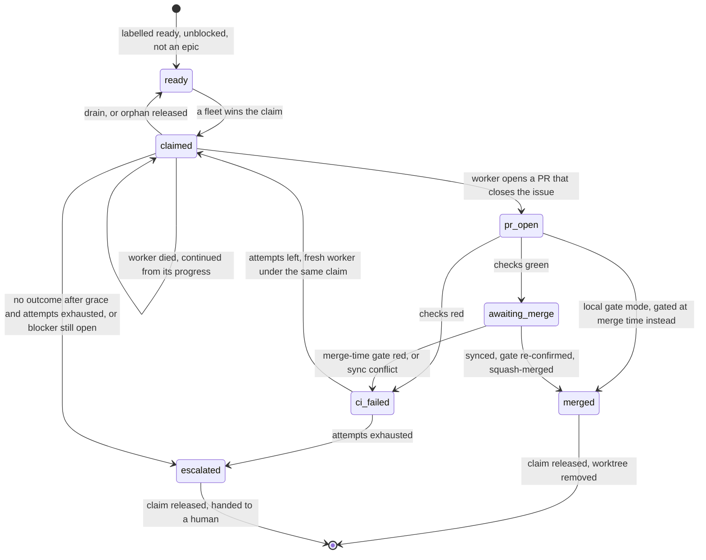

# Flows

afk-fleet turns a repo's ready GitHub issues into merged PRs with nobody watching, for days, across
one or several machines.

The nouns are in [`CONTEXT.md`](../CONTEXT.md), the reasons in [`docs/adr/`](adr/). This file is the
verbs: what happens, in what order, and what it leaves behind.

**Reading the anchors.** The fleet is a doc-driven skill (ADR-0004): the **launcher** and the
**tick** are LLM sessions executing the prose of `skills/afk-fleet/SKILL.md`, the **worker** executes
`skills/afk-fleet/references/worker-prompt.md`, and every deterministic step is a subcommand of
`skills/afk-fleet/scripts/afk.py` deciding through a pure function in
`skills/afk-fleet/scripts/afk_decide.py`. So an anchor into a `.py` file names a function, and an
anchor into a `.md` file names a word in the passage that step is executed from. Check them all with
the `mainline` skill's `verify-anchors.sh docs/flows.md`.

## How does a ready issue become a merged PR?

1. A **tick** starts with nothing in memory and **rebuilds** its **working set** from GitHub: open
   issues, open PRs, claim and heartbeat refs.
   `skills/afk-fleet/scripts/afk.py:cmd_rebuild`
2. The **frontier** is selected: an issue is dispatchable only if it is open, carries the ready
   label, is not an epic, is unclaimed, has no open linked PR and has zero open blockers.
   `skills/afk-fleet/scripts/afk_decide.py:select_frontier`
3. For each free slot under `concurrency`, the tick **claims** the issue by creating its claim ref;
   the server accepts that creation for exactly one **fleet instance**, and a loser skips the issue.
   `skills/afk-fleet/scripts/afk.py:cmd_claim`
4. The tick has orca create the worktree and branch from the latest base, starts a **worker** in it
   with the run's **worker launch command**, and submits the filled worker prompt.
   `skills/afk-fleet/SKILL.md:worker_command`
5. The tick refreshes its **heartbeat**, upserts the issue's **status board** to "claimed", returns
   its summary and dies, without waiting for the worker.
   `skills/afk-fleet/scripts/afk.py:cmd_status`
6. The worker implements the issue's acceptance criteria, committing and pushing its own branch
   after every completed step so a hard stop loses at most the step in flight.
   `skills/afk-fleet/references/worker-prompt.md:Publish`
7. The worker **syncs** (merges the base into its branch, never rebases), pushes, and runs the
   **local gate** until it is green on the combined tree.
   `skills/afk-fleet/references/worker-prompt.md:local_command`
8. The worker opens a PR whose body says `Closes #n`, and stops; it never merges.
   `skills/afk-fleet/references/worker-prompt.md:Closes`
9. A later tick's rebuild matches that PR to the claim and classifies it: awaiting merge once its
   checks are green (or, with `gate.ci: local`, as soon as the PR is open).
   `skills/afk-fleet/scripts/afk_decide.py:subclassify_pr`
10. One PR at a time, the tick syncs the branch with the merge target again and re-confirms the gate
    against the exact tree that will land.
    `skills/afk-fleet/scripts/afk.py:cmd_gate_run`
11. The tick squash-merges the PR, which closes the issue, and upserts the status board to "merged"
    while the issue is still its claim.
    `skills/afk-fleet/scripts/afk_decide.py:render_status_board`
12. The tick releases the claim and has orca remove the worktree, freeing the slot.
    `skills/afk-fleet/scripts/afk.py:cmd_release`

**Where it forks.**
- The worker opens no PR and leaves an `afk:verdict` marker instead (already-satisfied, blocked,
  giving-up), or goes quiet: `skills/afk-fleet/scripts/afk_decide.py:classify_no_pr`.
- The checks or the merge-time gate are red, or the sync conflicts: the retry mainline below.
- A peer wins the claim race, or the claim push fails outright (an error, never a lost race):
  ADR-0015.
- `--plan` stops after step 2 and returns the dispatch plan: ADR-0002.
- A cold `--tick` with no injected authorization does steps 1–10 and holds the merge: SKILL.md
  Guardrails.

## How does a fleet get permission once and then run for days?

1. A human invokes `/afk-fleet`; the **launcher** loads the target repo's config file, validated
   against the one schema with defaults filled, and refuses to run on an unknown key.
   `skills/afk-fleet/scripts/afk.py:cmd_config`
2. The launcher mints this run's instance id and probes the remote for which claim namespace it may
   push under, and, with a local gate, whether the merge target demands status checks.
   `skills/afk-fleet/scripts/afk.py:cmd_probe`
3. The launcher settles the **worker launch command**: a stock launcher is never asked, a launcher on
   a custom provider has the human pick the command and the answer is checked to resolve.
   `skills/afk-fleet/scripts/afk.py:cmd_worker_command`
4. The launcher spawns a **plan tick** and shows the human the dispatch plan it returns.
   `skills/afk-fleet/SKILL.md:Preview`
5. The human authorizes, once and for the whole run, pushing worker branches and auto-merging green
   PRs to the target.
   `skills/afk-fleet/SKILL.md:Authorize`
6. Each cycle, the launcher digests what a rebuild would observe and gets back skip or tick; the raw
   state never enters its context.
   `skills/afk-fleet/scripts/afk.py:cmd_fingerprint`
7. When the digest moved, the launcher spawns a fresh tick, handing it only the repo, the config and
   the three launcher-held facts (authorization, instance id, worker launch command).
   `skills/afk-fleet/SKILL.md:instance_id`
8. The tick does one reconciliation pass (the mainline above) and returns one compact summary; the
   launcher keeps that line, the digest and the skip streak, and nothing else.
   `skills/afk-fleet/SKILL.md:frontier_remaining`
9. The launcher sleeps a busy or an idle interval, never longer than half the lease while the fleet
   holds a claim, then repeats from step 6.
   `skills/afk-fleet/scripts/afk_decide.py:pace`
10. On the human's word, one final drain tick releases the claims that have no PR, keeps the ones
    that do, and the launcher spawns no more ticks.
    `skills/afk-fleet/scripts/afk.py:cmd_release`

**Where it forks.**
- The digest is unchanged: no tick is spawned, the launcher refreshes the heartbeat itself, and a
  full tick is forced every `force_tick_after_skips` cycles:
  `skills/afk-fleet/scripts/afk_decide.py:fingerprint_gate`, ADR-0007.
- The org forbids `refs/afk/*`, so claims fall back to ordinary branches:
  `skills/afk-fleet/scripts/afk.py:_usable_namespace`.
- A local gate meets a target branch that requires checks, and bootstrap stops:
  `skills/afk-fleet/scripts/afk_decide.py:protection_verdict`, ADR-0012.
- The launcher runs under qoderclicn, so the command is stock and nobody is asked:
  `skills/afk-fleet/scripts/afk_decide.py:detect_runtime`, ADR-0014.

## What happens to an issue when the fleet working on it dies?

1. While it holds any claim, a fleet instance refreshes its one **heartbeat** ref whenever it is
   older than a third of the lease.
   `skills/afk-fleet/scripts/afk_decide.py:heartbeat_due`
2. The fleet hard-stops and runs no code; a peer's next rebuild finds a claim whose owner's heartbeat
   is older than `claim_lease_ttl`, and classifies it a **stale claim**.
   `skills/afk-fleet/scripts/afk_decide.py:classify_claims`
3. The peer takes the claim by re-stamping the ref with its own instance, a push the server rejects
   unless the ref still points at the sha the peer read.
   `skills/afk-fleet/scripts/afk.py:cmd_reclaim`
4. The peer asks what survived the death: a worktree for the issue still on this machine, and the
   issue's branch on the remote ahead of base.
   `skills/afk-fleet/scripts/afk.py:cmd_recovery`
5. **Continuation** picks the tier: reuse the worktree, else recreate one at the pushed branch tip,
   else dispatch fresh from base.
   `skills/afk-fleet/scripts/afk_decide.py:select_recovery`
6. The tick starts a new worker there with the continue-mode prompt, which has it inspect the
   existing progress before anything else and treat it as partial work toward the same criteria.
   `skills/afk-fleet/references/worker-prompt.md:Continue`
7. The issue rejoins the first mainline at its step 6, its claim kept and its retry count untouched.
   `skills/afk-fleet/references/recovery.md:converges`

**Where it forks.**
- A human who knows the fleet is dead does not wait for the lease: **takeover**,
  `skills/afk-fleet/scripts/afk_decide.py:plan_takeover`, ADR-0011.
- The dead worker is one of this fleet's own (an **orphaned claim**): no reclaim, straight to step 4,
  reached from `skills/afk-fleet/scripts/afk_decide.py:classify_no_pr`.
- The peer's heartbeat is fresh: the claim is left strictly alone, ADR-0003.
- Two peers reclaim at once: one push wins, the other reports a lost race,
  `skills/afk-fleet/scripts/afk.py:_force_take`.

## How does a failing issue end up in a human's hands?

1. A tick's rebuild finds one of its claims with a PR whose checks are red, and marks it a failure.
   `skills/afk-fleet/scripts/afk_decide.py:pr_checks_state`
2. The rebuild reads the issue's attempt number off its `afk-attempt/<n>` label, the only place the
   count lives.
   `skills/afk-fleet/scripts/afk_decide.py:current_attempt`
3. The tick asks whether to retry or escalate: retry while the attempt is below `retry`.
   `skills/afk-fleet/scripts/afk_decide.py:next_attempt`
4. On retry, the tick swaps the attempt label up by one, tears the worktree down, and dispatches a
   fresh worker under the same claim, handing it the failure reason re-read from where it lives.
   `skills/afk-fleet/SKILL.md:from_label`
5. When the attempts are exhausted, the tick upserts the status board to "escalated" while the issue
   is still its claim.
   `skills/afk-fleet/scripts/afk.py:cmd_status`
6. The tick releases the claim.
   `skills/afk-fleet/scripts/afk.py:cmd_release`
7. The tick removes the ready label and the attempt label, adds the escalate label, and comments the
   stuck point with PR and log links; the issue is now a human's.
   `skills/afk-fleet/SKILL.md:escalate_label`

**Where it forks.**
- Other ways into step 1: a red merge-time gate (`skills/afk-fleet/scripts/afk_decide.py:gate_verdict`),
  an unresolvable sync conflict, an adversarial refute (`skills/afk-fleet/references/completion-gate.md:adversarial_verify`),
  or a worker idle past grace with a `giving-up` verdict or none at all
  (`skills/afk-fleet/scripts/afk_decide.py:classify_no_pr`).
- A worker that declares itself blocked is not a failure: re-dispatched when its blockers close,
  escalated as a DAG gap when they do not, never counted as an attempt (same function).
- A worker that declares the issue already satisfied, with nothing on its branch: the issue is
  closed and the claim released (same function).

## Invariants

- Any tick, given the same GitHub, rebuilds the same working set; nothing is remembered between
  ticks, and the status board is never read back. (ADR-0001, ADR-0006, ADR-0008;
  `test_rebuild_assembles_the_working_set_from_gh_and_refs`)
- A claim race has exactly one winner, and a push that failed for any other reason is an error,
  never a lost race. (ADR-0015; `test_claim_race_has_exactly_one_winner`,
  `test_a_failed_push_is_an_error_not_a_lost_race`)
- A fleet never takes a peer's claim unattended while that peer's heartbeat is within the lease, and
  its own claims stay its own even when its heartbeat has expired. (ADR-0003;
  `test_classify_claims`, `test_classify_claims_my_own_expired_stays_mine`)
- A claim is deleted at every terminal transition (merge, escalate, release), and a release that
  left the ref on the remote is an error, never "released". (ADR-0016;
  `test_a_release_that_did_not_delete_the_claim_is_an_error`)
- A branch catches up with its base by merging, never rebasing, and what lands on the target was
  gated in the form it lands; only exit 0 is green, and a timeout is red. (ADR-0012;
  `test_gate_run_is_green_only_on_exit_zero`)
- Commits ahead and a dirty tree are standing facts, never signs of life: only a busy terminal or
  activity within the grace period keeps a PR-less claim "coding". (ADR-0013;
  `test_classify_no_pr_coding_needs_a_live_signal`)
- A dead worker's progress is continued, never restarted while any survives; only tier 3 tears a
  worktree down, and neither continuation nor takeover reads or increments the attempt count.
  (ADR-0011; `test_select_recovery`)
- An unreadable remote is an error, never an empty fleet, and no subcommand runs without the run's
  config. (ADR-0015, ADR-0016; `test_an_unreadable_remote_is_an_error_not_an_empty_fleet`,
  `test_config_is_required_and_resolves_one_way_on_every_subcommand`)

## An issue's life

The states are the status board's phases (`skills/afk-fleet/scripts/afk_decide.py:STATUS_PHASES`),
plus the two a board never shows: ready before any claim, and released back to ready.

## Worked example

One tick's rebuild, with the values of `test_assemble_working_set` in
`skills/afk-fleet/scripts/test_afk_decide.py`. The instance is `me`, the clock reads `100000`, the
lease is `4500` seconds, `gate.ci` is `required`, and GitHub holds six open issues, one open PR and
four claim refs.

| Issue | Labels | Claim (owner, sha) | Owner's heartbeat | PR | Lands in the working set as |
|---|---|---|---|---|---|
| #1 "ready" | `ready-for-agent` | none | | | `frontier.dispatch` |
| #2 "blocked" | `ready-for-agent` | none | | | excluded: `1 open blocker(s)` |
| #3 "mine green" | `ready-for-agent` | `me`, `s3` | 10 s ago | #30, one check `SUCCESS` | `mine`: `awaiting_merge`, `checks: green`, `attempt: 0` |
| #4 "mine coding" | `afk-attempt/1` | `me`, `s4` | 10 s ago | none | `mine`: `no_pr`, board phase `claimed`, `attempt: 1` |
| #5 "peer live" | `ready-for-agent` | `peerA`, `s5` | 100 s ago | | `peer_live` |
| #6 "peer dead" | none | `peerB`, `s6` | 5499 s ago | | `stale`, carrying `sha: s6` |

What the tick then does, each row a different mainline:

- **#3** is the first mainline from step 10: sync, re-confirm the gate, squash-merge PR #30, board
  to "merged", release the claim.
- **#1** is the first mainline from step 3: claim it, hand it to orca, send the worker its prompt.
- **#6** is the dead-fleet mainline from step 3: `peerB` last beat 5499 s ago, past the 4500 s
  lease, so reclaim with `--expect-sha s6`, then recover by continuation.
- **#4** has no PR, so the tick probes its terminal and asks `afk no-pr` why; it is already on
  attempt 1, so if the answer is a failure, one more retry is left before it escalates (`retry`
  defaults to 2).
- **#5** is left strictly alone: `peerA` beat 100 s ago.
- **#2** waits: it rejoins the frontier when its blocker closes.

The same test then flips two things worth knowing. With the PR's check `FAILURE`, #3 becomes
`failure` (board `ci_failed`); with that same red check and `gate.ci: local`, #3 is still
`awaiting_merge` (board `pr_open`), because the remote check is not the gate. And with the lease cut
to 50 seconds, #5 goes stale too.
