# Flows

afk-fleet turns a repo's ready GitHub issues into merged PRs with nobody watching, for days, across
one or several machines.

The nouns are in [`CONTEXT.md`](../CONTEXT.md), the reasons in [`docs/adr/`](adr/). This file is the
verbs: what happens, in what order, and what it leaves behind.

**Reading the anchors.** The fleet is a doc-driven skill (ADR-0004): the **launcher** and the
**tick** are LLM sessions executing the prose of `skills/afk-fleet/SKILL.md`, the **worker** executes
`skills/afk-fleet/references/worker-prompt.md`, and every deterministic step is a subcommand of
`skills/afk-fleet/scripts/afk.py` deciding through a pure function in
`skills/afk-fleet/scripts/afk_decide.py`. Each thing a tick *does* to a claim — start a worker, land
a PR, fail, escalate, park, close — is one such subcommand performing its whole ordered sequence
(ADR-0017), so most steps below anchor into code. An anchor into a `.py` file names a function, and
an anchor into a `.md` file names a word in the passage that step is executed from. Check them all with
the `mainline` skill's `verify-anchors.sh docs/flows.md`.

## How does a ready issue become a merged PR?

1. A **tick** starts with nothing in memory and **rebuilds** its **working set** from GitHub: open
   issues, open PRs, claim and heartbeat refs.
   `skills/afk-fleet/scripts/afk.py:cmd_rebuild`
2. The **frontier** is selected: an issue is dispatchable only if it is open, carries the ready
   label, is not an epic, is unclaimed, has no open linked PR and has zero open blockers.
   `skills/afk-fleet/scripts/afk_decide.py:select_frontier`
3. For each free slot under `concurrency`, the tick **dispatches** an issue, and the dispatch begins
   by **claiming** it: creating its claim ref, which the server accepts for exactly one **fleet
   instance**; a loser starts nothing.
   `skills/afk-fleet/scripts/afk.py:cmd_dispatch`
4. The dispatch fetches the base's tip from the remote and has orca create the worktree and branch
   at that sha, then asserts the worktree contains it.
   `skills/afk-fleet/scripts/afk.py:_create_worktree`
5. It starts a **worker** there with the run's **worker launch command**, waits until the agent is
   ready, and delivers the worker prompt, filled with the branch and path orca returned, as a brief
   file plus one submitted line pointing at it.
   `skills/afk-fleet/scripts/afk.py:_start_terminal`
6. It upserts the issue's **status board** to "claimed"; the tick refreshes its **heartbeat**,
   returns its summary and dies, without waiting for the worker.
   `skills/afk-fleet/scripts/afk.py:_upsert_board`
7. The worker implements the issue's acceptance criteria, committing and pushing its own branch
   after every completed step so a hard stop loses at most the step in flight.
   `skills/afk-fleet/references/worker-prompt.md:Publish`
8. The worker **syncs** (merges the base into its branch, never rebases), pushes, and runs the
   **local gate** until it is green on the combined tree.
   `skills/afk-fleet/references/worker-prompt.md:local_command`
9. The worker opens a PR whose body says `Closes #n`, **wakes** the launcher with one line that
   carries nothing, and stops; it never merges.
   `skills/afk-fleet/scripts/afk_decide.py:wake_command`
10. A later tick's rebuild matches that PR to the claim and classifies it: awaiting merge once its
    checks are green (or, with `gate.ci: local`, as soon as the PR is open).
    `skills/afk-fleet/scripts/afk_decide.py:subclassify_pr`
11. One PR at a time, the tick **merges**: the merge syncs the branch with the merge target again,
    in the issue's worktree, and pushes what that produced.
    `skills/afk-fleet/scripts/afk.py:_sync`
12. It re-confirms the gate against the exact head that will land: the local gate run there, or the
    PR's checks, which count only if the sync did not move the head.
    `skills/afk-fleet/scripts/afk_decide.py:checks_gate`
13. It merges the PR, pinned to the gated head, which closes the issue; upserts the status board to
    "merged"; releases the claim; and has orca remove the worktree, freeing the slot.
    `skills/afk-fleet/scripts/afk.py:cmd_merge`

**Where it forks.**
- The worker opens no PR and leaves an `afk:verdict` marker instead (already-satisfied, blocked,
  giving-up), or goes quiet: `skills/afk-fleet/scripts/afk_decide.py:classify_no_pr`.
- While the worker is still at it, the tick's question costs no GitHub read: the worker state its
  runtime reported to orca settles it, `skills/afk-fleet/scripts/afk_decide.py:read_worker_state`
  (ADR-0021).
- The worker went idle past grace with no PR and no verdict at all: it is nudged once, in its own
  terminal, before that silence counts as a failure, `skills/afk-fleet/scripts/afk.py:cmd_nudge`
  (ADR-0018).
- The worker declared the issue already satisfied and its branch is empty: the tick verifies the
  empty diff and closes it, `skills/afk-fleet/scripts/afk.py:cmd_close`.
- The checks or the merge-time gate are red: the retry mainline below.
- The sync conflicts: the merge stops, and the tick **hands the conflict back** to the worker that
  wrote the branch — claim, PR, branch and worktree kept, no attempt spent,
  `skills/afk-fleet/scripts/afk.py:cmd_hand_back` (ADR-0019). The claim is then `handed_back`, not
  awaiting merge, until the PR head contains the target tip it named
  (`skills/afk-fleet/scripts/afk_decide.py:handback_open`), and rejoins this mainline at step 10.
- The PR has no checks at all, or an adversarial verify is required: the merge stops and the tick
  decides (`--allow-no-checks`, `--verified`), `skills/afk-fleet/SKILL.md:needs_verify`.
- A peer wins the claim race, or the claim push fails outright (an error, never a lost race):
  ADR-0015.
- `--plan` stops after step 2 and returns the dispatch plan: ADR-0002.
- A cold `--tick` with no injected authorization does steps 1–10 and calls no merge: SKILL.md
  Guardrails.

## How does a fleet get permission once and then run for days?

1. A human invokes `/afk-fleet`; the **launcher** loads the target repo's config file, validated
   against the one schema with defaults filled, and refuses to run on an unknown key.
   `skills/afk-fleet/scripts/afk.py:cmd_config`
2. The launcher mints this run's instance id and probes the remote for which claim namespace it may
   push under, and, with a local gate, whether the merge target demands status checks.
   `skills/afk-fleet/scripts/afk.py:cmd_probe`
3. The launcher settles the **worker launch command**: a stock launcher is never asked, a launcher on
   a custom provider has the human pick the command and the answer is checked to resolve.
   `skills/afk-fleet/scripts/afk.py:cmd_worker_command`
4. The launcher spawns a **plan tick** and shows the human the dispatch plan it returns.
   `skills/afk-fleet/SKILL.md:Preview`
5. The human authorizes, once and for the whole run, pushing worker branches and auto-merging green
   PRs to the target.
   `skills/afk-fleet/SKILL.md:Authorize`
6. Each cycle, the launcher opens with one call that digests what a rebuild would observe and gets
   back skip or tick, plus an opaque cycle state to hand back; the raw state never enters its context.
   `skills/afk-fleet/scripts/afk.py:cmd_cycle`
7. When the digest moved, the launcher spawns a fresh tick, handing it only the repo, the config and
   the three launcher-held facts (authorization, instance id, worker launch command).
   `skills/afk-fleet/SKILL.md:instance_id`
8. The tick does one reconciliation pass (the mainline above) and returns one compact summary, which
   the launcher hands back to the same call; it folds the summary into the cycle state and counts
   whether the cycle was empty.
   `skills/afk-fleet/scripts/afk_decide.py:cycle_ticked`
9. The launcher sleeps the interval that call returned — busy, or idle after enough consecutive
   empty cycles, never longer than half the lease while the fleet holds a claim — then repeats from
   step 6, keeping nothing but the cycle state.
   `skills/afk-fleet/scripts/afk_decide.py:pace`
10. On the human's word, one final drain tick releases the claims that have no PR, keeps the ones
    that do, and the launcher spawns no more ticks.
    `skills/afk-fleet/scripts/afk.py:cmd_release`

**Where it forks.**
- The digest is unchanged: no tick is spawned, the same call refreshes the heartbeat if the fleet
  holds claims and returns the sleep, and a full tick is forced every `force_tick_after_skips`
  cycles: `skills/afk-fleet/scripts/afk_decide.py:cycle_wake`, ADR-0007.
- A worker's **wake** arrives during the sleep of step 9: the launcher goes to step 6 at once, and
  acts on nothing the line says, `skills/afk-fleet/SKILL.md:wake`, ADR-0020.
- The org forbids `refs/afk/*`, so claims fall back to ordinary branches:
  `skills/afk-fleet/scripts/afk.py:_usable_namespace`.
- A local gate meets a target branch that requires checks, and bootstrap stops:
  `skills/afk-fleet/scripts/afk_decide.py:protection_verdict`, ADR-0012.
- The launcher runs under qoderclicn, so the command is stock and nobody is asked:
  `skills/afk-fleet/scripts/afk_decide.py:detect_runtime`, ADR-0014.

## What happens to an issue when the fleet working on it dies?

1. While it holds any claim, a fleet instance refreshes its one **heartbeat** ref whenever it is
   older than a third of the lease.
   `skills/afk-fleet/scripts/afk_decide.py:heartbeat_due`
2. The fleet hard-stops and runs no code; a peer's next rebuild finds a claim whose owner's heartbeat
   is older than `claim_lease_ttl_seconds`, and classifies it a **stale claim**.
   `skills/afk-fleet/scripts/afk_decide.py:classify_claims`
3. The peer takes the claim by re-stamping the ref with its own instance, a push the server rejects
   unless the ref still points at the sha the peer read.
   `skills/afk-fleet/scripts/afk.py:cmd_reclaim`
4. The peer **dispatches** the issue it now holds; the dispatch asks what survived the death: a
   worktree for the issue still on this machine, and the issue's branch on the remote ahead of base.
   `skills/afk-fleet/scripts/afk.py:_recovery`
5. **Continuation** picks the tier: reuse the worktree, else recreate one at the pushed branch tip,
   else start fresh from base.
   `skills/afk-fleet/scripts/afk_decide.py:select_recovery`
6. The dispatch starts a new worker there with the continue-mode prompt, which has it inspect the
   existing progress before anything else and treat it as partial work toward the same criteria.
   `skills/afk-fleet/scripts/afk_decide.py:render_worker_prompt`
7. The issue rejoins the first mainline at its step 7, its claim kept and its retry count untouched.
   `skills/afk-fleet/references/recovery.md:converges`

**Where it forks.**
- A human who knows the fleet is dead does not wait for the lease: **takeover**,
  `skills/afk-fleet/scripts/afk_decide.py:plan_takeover`, ADR-0011.
- The dead worker is one of this fleet's own (an **orphaned claim**): no reclaim, straight to step 4,
  reached from `skills/afk-fleet/scripts/afk_decide.py:classify_no_pr`.
- The tick judges the surviving state not worth continuing: a fresh start discards it instead,
  `skills/afk-fleet/scripts/afk.py:_discard_attempt`.
- The peer's heartbeat is fresh: the claim is left strictly alone, ADR-0003.
- Two peers reclaim at once: one push wins, the other reports a lost race,
  `skills/afk-fleet/scripts/afk.py:_force_take`.

## How does a failing issue end up in a human's hands?

1. A tick's rebuild finds one of its claims with a PR whose checks are red, and marks it a failure.
   `skills/afk-fleet/scripts/afk_decide.py:pr_checks_state`
2. The rebuild reads the issue's attempt number off its `afk-attempt/<n>` label, the only place the
   count lives.
   `skills/afk-fleet/scripts/afk_decide.py:current_attempt`
3. The tick **fails** the claim, giving the reason re-read from where it lives; the retry ladder
   decides: retry while the attempt is below `retry`.
   `skills/afk-fleet/scripts/afk_decide.py:next_attempt`
4. On retry, the label is swapped up by one and the failed attempt is discarded: its PR closed, its
   branch deleted, its worktree removed.
   `skills/afk-fleet/scripts/afk.py:_discard_attempt`
5. A fresh worker is started from the base under the same claim, its prompt ending with the failure
   reason.
   `skills/afk-fleet/scripts/afk.py:cmd_fail`
6. When the attempts are exhausted, the status board is upserted to "escalated" and the issue is
   relabelled: the escalate label on, the ready label and the attempt label off.
   `skills/afk-fleet/scripts/afk_decide.py:escalation_labels`
7. The stuck point is commented with the PR, and only then is the claim released; the issue is now
   a human's, with its PR and worktree left as evidence.
   `skills/afk-fleet/scripts/afk.py:_escalate`

**Where it forks.**
- Other ways into step 1: a red merge-time gate (`skills/afk-fleet/scripts/afk_decide.py:gate_verdict`),
  a sync conflict handed back to its worker and never answered, an adversarial refute (`skills/afk-fleet/references/completion-gate.md:adversarial_verify`),
  or a worker idle past grace with a `giving-up` verdict or none at all
  (`skills/afk-fleet/scripts/afk_decide.py:classify_no_pr`).
- A worker that declares itself blocked is not a failure and never counts as an attempt. Where each
  blocker it names stands decides (`skills/afk-fleet/scripts/afk_decide.py:blocker_standings`):
  all closed, it is re-dispatched; still open but workable backlog, it is **parked** — the
  dependency recorded as a native `blocked_by` edge and the claim released, so the frontier holds it
  back until the blocker closes (`skills/afk-fleet/scripts/afk.py:cmd_park`, ADR-0022); one nothing
  will resolve, or none named, it is escalated as a DAG gap
  (`skills/afk-fleet/scripts/afk.py:cmd_escalate`).
- A worker that declares the issue already satisfied, with nothing on its branch: the issue is
  closed and the claim released (the first mainline's fork).

## Invariants

- Any tick, given the same GitHub, rebuilds the same working set; nothing is remembered between
  ticks, and the status board is never read back. (ADR-0001, ADR-0006, ADR-0008;
  `test_rebuild_assembles_the_working_set_from_gh_and_refs`)
- A claim race has exactly one winner, and a push that failed for any other reason is an error,
  never a lost race. (ADR-0015; `test_claim_race_has_exactly_one_winner`,
  `test_a_failed_push_is_an_error_not_a_lost_race`)
- A fleet never takes a peer's claim unattended while that peer's heartbeat is within the lease, and
  its own claims stay its own even when its heartbeat has expired. (ADR-0003;
  `test_classify_claims`, `test_classify_claims_my_own_expired_stays_mine`)
- A claim is deleted at every terminal transition (merge, escalate, park, close, release) and as its
  last step — after the PR landed, after the relabel, after the dependency edge — and a release that
  left the ref on the remote is an error, never "released". (ADR-0016, ADR-0017;
  `test_a_release_that_did_not_delete_the_claim_is_an_error`,
  `test_escalate_relabels_before_it_releases`)
- A dependency a worker discovers is recorded on GitHub and waited on, never handed to a human, while
  the backlog will resolve it; a parked issue keeps its ready label, costs no attempt, and cannot be
  dispatched again while a blocker it named is open. (ADR-0022;
  `test_blocker_standings_tell_a_dependency_the_backlog_resolves_from_one_nothing_will`,
  `test_a_worker_blocked_on_workable_backlog_is_parked_until_the_blocker_closes`)
- A branch catches up with its base by merging, never rebasing, and what lands on the target was
  gated in the form it lands; only exit 0 is green, and a timeout is red. (ADR-0012, ADR-0017;
  `test_merge_gates_the_tree_that_lands_then_settles_the_claim`,
  `test_merge_in_required_mode_trusts_checks_only_on_the_head_that_lands`)
- A worker starts from the commit the remote has, never a stale local branch, and is told the branch
  orca actually created. (ADR-0017;
  `test_dispatch_starts_a_worker_on_the_remote_base_tip_and_submits_its_prompt`)
- Commits ahead and a dirty tree are standing facts, never signs of life: only a busy worker or
  activity within the grace period keeps a PR-less claim "coding". (ADR-0013;
  `test_classify_no_pr_coding_needs_a_live_signal`)
- A worker is busy only while its runtime reports it working **and** its terminal still produces
  output; an orca that cannot be read is an error, never a gone worker. (ADR-0021;
  `test_read_worker_state_takes_the_runtimes_own_report`,
  `test_no_pr_asks_after_every_worker_in_one_call_and_only_reads_github_for_stopped_ones`)
- A dead worker's progress is continued, never restarted while any survives; continuation tears
  nothing down — only a retry or an explicit fresh start discards an attempt — and neither
  continuation nor takeover reads or increments the attempt count.
  (ADR-0011; `test_select_recovery`, `test_dispatch_continues_from_whatever_progress_survived`)
- A sync conflict is not a failure of the work: it is handed back to the worker that wrote the
  branch, spends no attempt and discards nothing, and the claim is not awaiting merge again until
  the PR head contains the target tip the hand-back named; only a hand-back the worker never answers
  enters the retry ladder. (ADR-0019;
  `test_hand_back_returns_a_sync_conflict_to_the_worker_that_wrote_the_branch`,
  `test_an_unanswered_hand_back_falls_through_to_the_nudge_and_then_the_retry_ladder`)
- A wake carries no state and nothing waits on one: the cycle it opens reads GitHub like any other,
  and a worker with no launcher terminal to wake is given a no-op. (ADR-0020;
  `test_a_worker_is_told_how_to_wake_the_launcher_and_nothing_else`)
- An unreadable remote is an error, never an empty fleet, and no subcommand runs without the run's
  config. (ADR-0015, ADR-0016; `test_an_unreadable_remote_is_an_error_not_an_empty_fleet`,
  `test_config_is_required_and_resolves_one_way_on_every_subcommand`)

## An issue's life

The states are the status board's phases (`skills/afk-fleet/scripts/afk_decide.py:STATUS_PHASES`),
plus the two a board never shows: ready before any claim, and released back to ready. (A parked
issue's board stays up while it waits, unclaimed.)

```mermaid
stateDiagram-v2
  [*] --> ready: labelled ready, unblocked, not an epic
  ready --> claimed: a fleet wins the claim
  claimed --> pr_open: worker opens a PR that closes the issue
  claimed --> claimed: worker died, continued from its progress
  claimed --> ready: drain, or orphan released
  pr_open --> awaiting_merge: checks green
  pr_open --> merged: local gate mode, gated at merge time instead
  pr_open --> ci_failed: checks red
  awaiting_merge --> merged: synced, gate re-confirmed, squash-merged
  awaiting_merge --> ci_failed: merge-time gate red
  awaiting_merge --> handed_back: sync conflict, returned to its worker
  pr_open --> handed_back: local gate mode, sync conflict at merge time
  handed_back --> awaiting_merge: worker merged the target in and pushed
  handed_back --> handed_back: worker died, continued on the hand-back
  handed_back --> ci_failed: never answered, after one nudge
  ci_failed --> claimed: attempts left, fresh worker under the same claim
  ci_failed --> escalated: attempts exhausted
  claimed --> escalated: no outcome after grace and attempts exhausted, or a blocker nothing will resolve
  claimed --> parked: worker blocked on open, workable backlog; dependency recorded, claim released
  parked --> ready: every blocker it named has closed
  claimed --> closed: already satisfied, empty diff verified
  closed --> [*]: claim released, worktree removed
  merged --> [*]: claim released, worktree removed
  escalated --> [*]: claim released, handed to a human
```

## Worked example

One tick's rebuild, with the values of `test_assemble_working_set` in
`skills/afk-fleet/scripts/test_afk_decide.py`. The instance is `me`, the clock reads `100000`, the
lease is `4500` seconds, `gate.ci` is `required`, and GitHub holds six open issues, one open PR and
four claim refs.

| Issue | Labels | Claim (owner, sha) | Owner's heartbeat | PR | Lands in the working set as |
|---|---|---|---|---|---|
| #1 "ready" | `ready-for-agent` | none | | | `frontier.dispatch` |
| #2 "blocked" | `ready-for-agent` | none | | | excluded: `1 open blocker(s)` |
| #3 "mine green" | `ready-for-agent` | `me`, `s3` | 10 s ago | #30, one check `SUCCESS` | `mine`: `awaiting_merge`, `checks: green`, `attempt: 0` |
| #4 "mine coding" | `afk-attempt/1` | `me`, `s4` | 10 s ago | none | `mine`: `no_pr`, board phase `claimed`, `attempt: 1` |
| #5 "peer live" | `ready-for-agent` | `peerA`, `s5` | 100 s ago | | `peer_live` |
| #6 "peer dead" | none | `peerB`, `s6` | 5499 s ago | | `stale`, carrying `sha: s6` |

What the tick then does, each row a different mainline:

- **#3** is the first mainline from step 11: `afk merge` syncs, re-confirms the gate, squash-merges
  PR #30, sets the board to "merged" and releases the claim.
- **#1** is the first mainline from step 3: `afk dispatch` claims it, has orca create the worktree,
  and delivers the worker its prompt. The row also says `free_slots: 1` — one slot is all
  `concurrency: 3` leaves beside the two claims held.
- **#6** is the dead-fleet mainline from step 3: `peerB` last beat 5499 s ago, past the 4500 s
  lease, so reclaim with `--expect-sha s6`, then `afk dispatch` recovers it by continuation.
- **#4** has no PR, so the tick asks `afk no-pr` why — a worker orca reports busy is left at once; it is already on
  attempt 1, so if the answer is a failure, `afk fail` has one more retry left before it escalates
  (`retry` defaults to 2).
- **#5** is left strictly alone: `peerA` beat 100 s ago.
- **#2** waits: it rejoins the frontier when its blocker closes.

The same test then flips two things worth knowing. With the PR's check `FAILURE`, #3 becomes
`failure` (board `ci_failed`); with that same red check and `gate.ci: local`, #3 is still
`awaiting_merge` (board `pr_open`), because the remote check is not the gate. And with the lease cut
to 50 seconds, #5 goes stale too.
